# Stockholm Blood Donation Organization

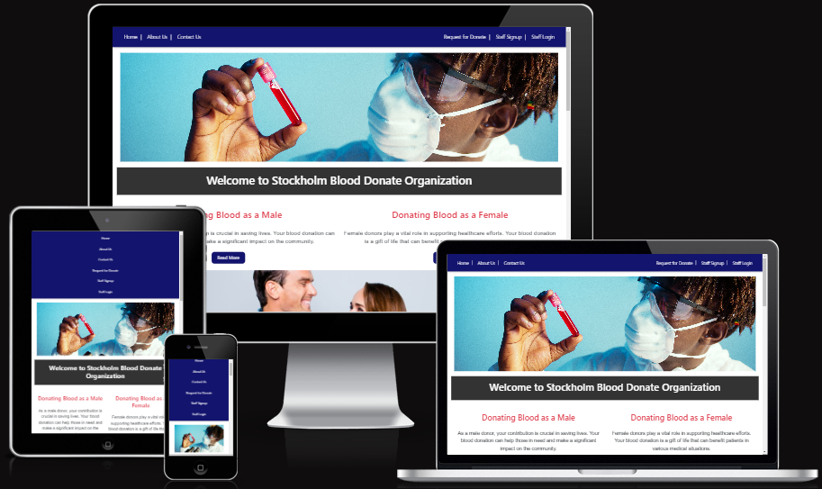

## Description

Welcome to the [Stockholm-Blood-Donation-Organization](https://stockholm-blood-donate-organization.onrender.com) Organization, your online platform for those who want to make a meaningful impact by donating blood. Our website provides a simple and convenient space for individuals to submit their information and join the community of compassionate donors. Join us in the mission to **save lives** — share the gift of life through your **blood donation**.

## Technology Used

The Stockholm Blood Donation Organization website is built using a modern stack of technologies to ensure a robust and interactive user experience. Here are the key technologies utilized in the development:

- **HTML:** The backbone for structuring the content and presenting information on the web.

- **CSS:** Responsible for styling and enhancing the visual presentation of the website, ensuring an appealing and consistent look.

- **JavaScript:** Employed for dynamic and interactive elements on the website, enhancing user engagement.

- **React.js:** A powerful JavaScript library used to build the user interface, enabling the creation of seamless, responsive, and efficient components.

These technologies work in harmony to deliver a user-friendly, visually appealing, and technologically advanced blood donation platform.

## Installation

Get started with the Blood Donate Organization website by following these simple steps:

1. **Clone the Repository:**

- git clone https://github.com/NaifZaghmout/Blood-Donate.git

2. **Navigate to the Project Directory:**
   
- cd Blood-Donate

3. **Install Dependencies:**

- npm install

**This command installs all the required dependencies, including:**

  - FontAwesome for SVG icons
  - Axios for making HTTP requests
  - Bootstrap for styling
  - Cloudinary for image and video management
  - History for managing session history
  - MDBReact for Material Design components
  - MSW for mocking API requests during development
  - React and related libraries for building the UI
  - SweetAlert for displaying attractive alerts
  - Web Vitals for measuring web performance

4. **Start the Development Server:**

- npm start

**Note:** Make sure you have Node.js and npm installed on your machine before proceeding with the installation steps.

## Features

### 1. Navigation Bar and Hero Image

- **Navbar:**
  - Allows easy navigation with links to Home, About Us, Contact Us, Blood Donate Request, Staff Signup, Staff Login, and Staff Page.

      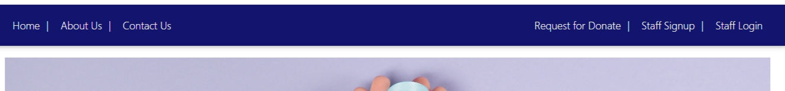

  
- **Hero Image:**
  - Displays a captivating hero image with automatic image rotation every 3 seconds.
  - Provides a brief description of the organization.

      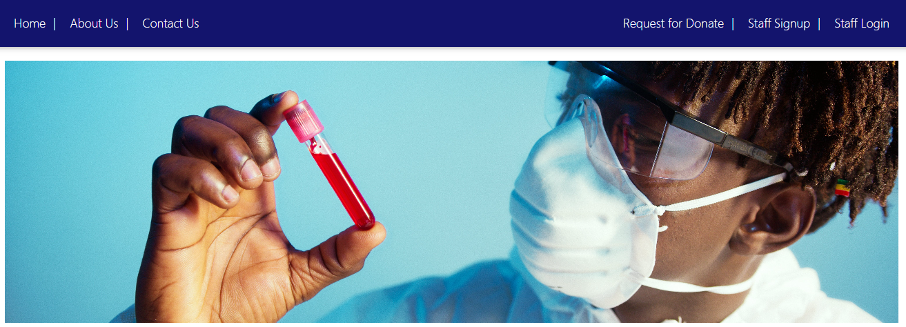

### 2. Header / Donating Blood as a Male and Female 

- **Header and Donating Blood as a Male and Female :**
  - Displays the name of the organization.
  - Includes information about blood donation for both males and females.
  - Read More Button: Redirects users to an external website for detailed information.

      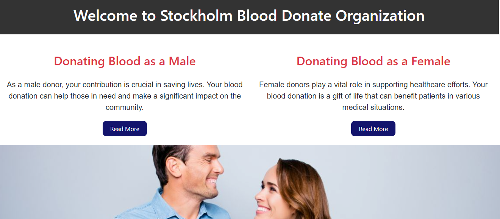

### 3. Health Benefits for Blood Donation Section

- **Benefits Section:**
  - Provides information about the health benefits of blood donation.
  - Read More Button: Redirects users to an external website for in-depth details.

      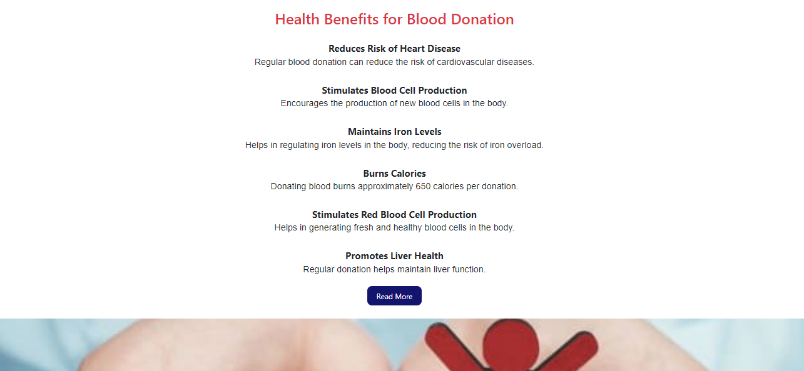

### 4. Who Can Donate? Section

- **Eligibility Section:**
  - Explains who can donate blood.
  - Read More Button: Redirects users to an external website for more information.

      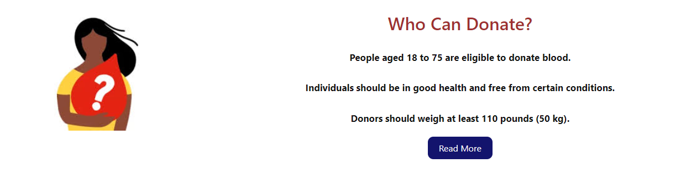

### 5. About Us Page

- **About Us:**
  - Features an informative page about the organization.

      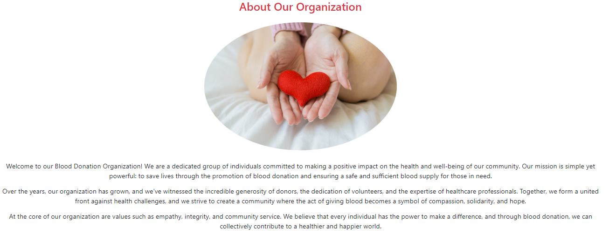

### 6. Why We Help Section in About Us

- **Reasons Behind Our Mission:**
  - Explores the reasons and motivations behind the organization's commitment to helping people donate blood.
  - Provides insights into the impact and significance of blood donation.

      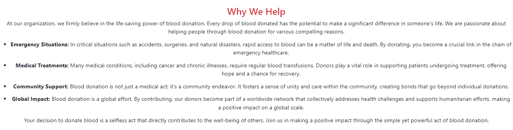

### 7. Contact Us Page

- **Contact Details:**
  - Provides organization contact information, including phone, address, and email.

      

  
- **Message Form:**
  - Includes a user-friendly form for users to send messages to the organization.
  - Fields for name, email, subject, and message.
  - Submit button to send the message.

      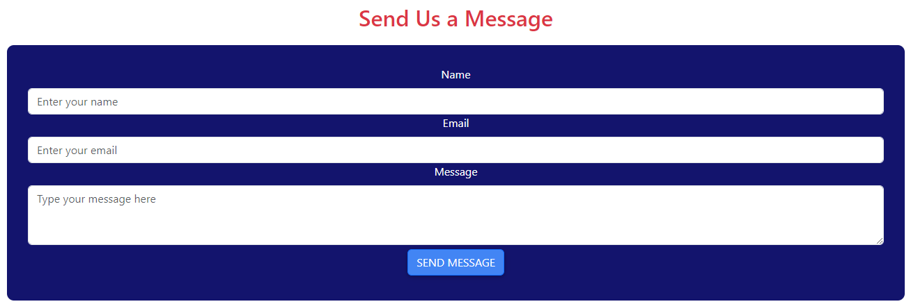

### 8. Request for Donate Page

- **Make a Difference Message:**
  - Features a compelling message: "Make a Difference with Your Donation."

       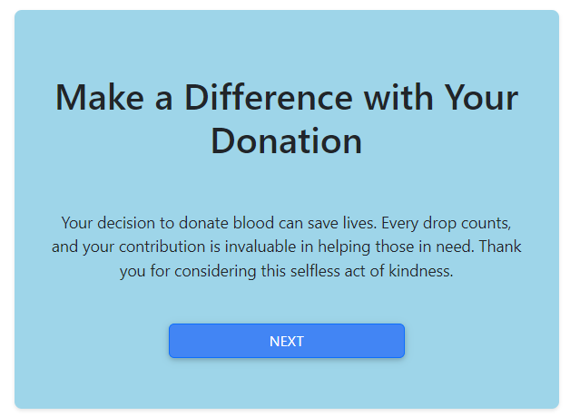

- **Ready to Be a Hero Message:**
  - Encourages users with the message: "Ready to Be a Hero?"

      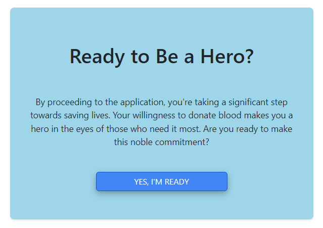

- **Blood Donation Application:**
  - Provides information about the Blood Donation Application.
  - Includes a link to the application for individuals who want to donate blood and make a difference.

      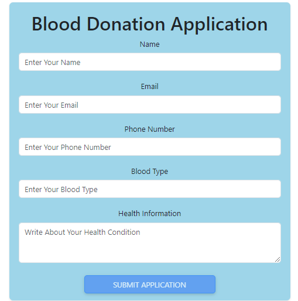

### 9. Staff Signup

- **Staff Signup Form:**
  - Allows staff members to register on the platform.

      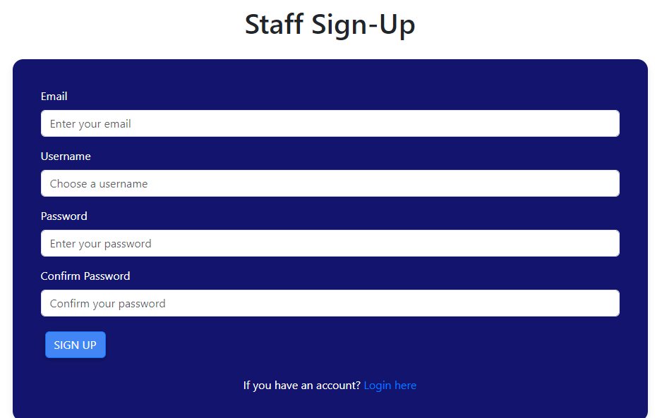

### 10. Staff Login

- **Staff Login Form:**
  - Enables staff members to log in to the management panel.

      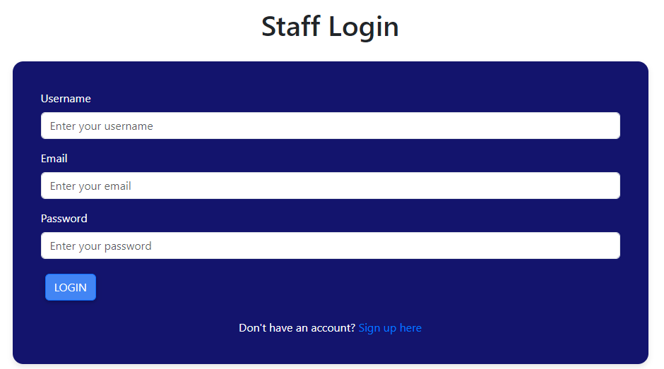

### 11. Staff Navigation Bar

- After successful login, staff members will have access to a dedicated navigation bar The staff navigation bar includes links to the following:

  - Home

  - About Us

  - Contact Us

  - Blood Donate Request

  - Staff Profile

      

### 12. Accessing Staff Profile

  - A small avatar with an arrow is located on the right side of the navbar.
  - When staff members click on the avatar, a dropdown menu appears with two options: "Profile" and "Logout."
  - Clicking on "Profile" redirects staff members to their individual staff profile page.
  - Clicking on "Logout" logs the staff member out of the system

      

### 13.  Staff Profile Page

  - Staff members can access their profile page by clicking on the "Profile" option in the dropdown menu from the small avatar in the navbar.
  - The profile page displays the following information:
    - Staff ID
    - Email
    - Biography (BIO)
    - Current profile image

      

### Edit profile 

- Staff members can click on the "Edit" button to update their profile information, Like changing the profile image and editing the biography.

      

### 14. Staff Page

- **Staff Page:**
  - Contains a "Donors List" with information for people who want to donate blood.
  - Staff actions to review and manage the information submitted by people applying for blood donation.

      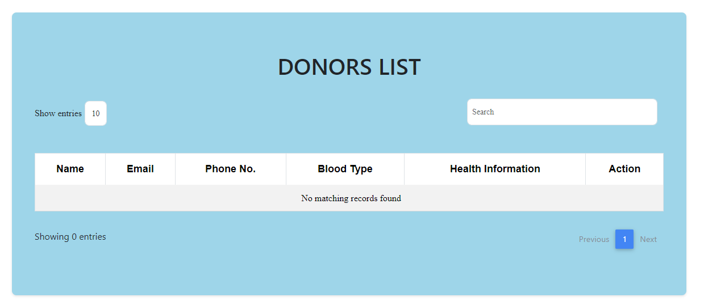

### 15. Footer

- **Footer:**
  - Contains social media links to follow the organization.
  - Includes a copyright statement.

      

### 16. Success messages

  - All Success messages

      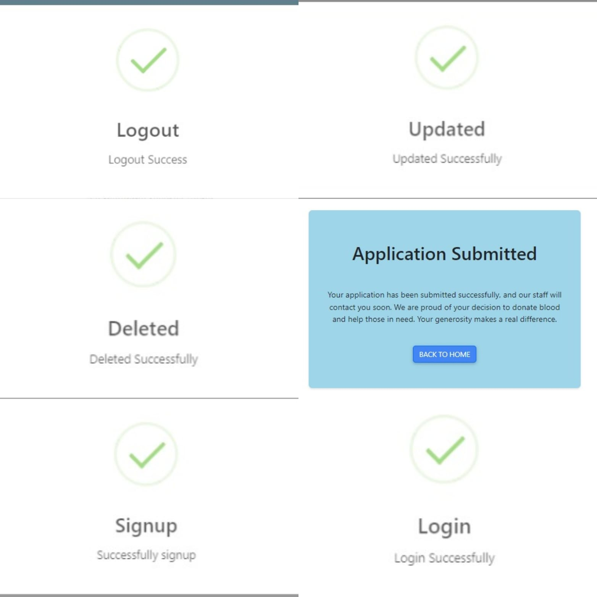

### 17. Error messages

  - All Error messages

  
      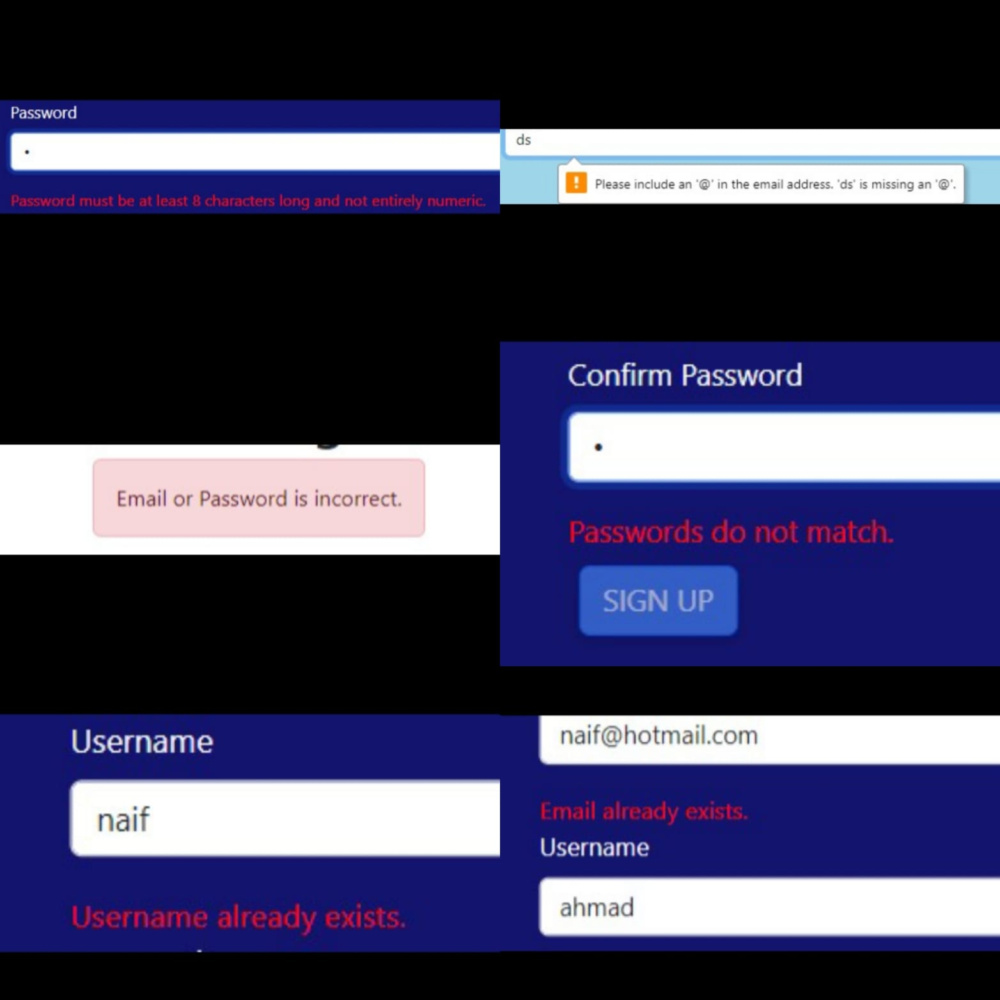

## Bugs and Remaining Bugs

#### Bugs 

1. Login Issue with Fetch

- **Error Handling with Fetch:**

**Issue:** The 'fetch' API used for login lacked robust error handling, resulting in unclear error messages for users with incorrect credentials.
**Symptoms:** Users encountered difficulties understanding login failures due to insufficient error feedback.
**Resolution:** Switching to axios improved error handling, providing clear and specific error messages for login failures.

  -  **Before:** Inadequate error handling with fetch

`fetch("api/login", {
  method: "POST",
  body: JSON.stringify(formData),
  headers: {
    "Content-Type": "application/json",
  },
})
.then(response => {
  // Inadequate error handling
})
.catch(error => {
  // Inadequate error handling
});`

  - **After:** Clear and specific error handling with axios

`try {
  const response = await axios.post("api/login", formData);
  // Clear and specific error handling
} catch (error) {
  // Clear and specific error handling
}`

2. Unable to Save Updated Donor Information

**Issue:** After making changes to donor information and clicking the "Save" button, the application does not save the updated information, and there is no success message.

**Symptoms:** Users attempting to save updated donor information encountered the following issues **(Inability to Trigger Save Actions)**

**Resolution:** After investigating the issue, it was discovered that the handleSubmit function was not correctly updating the donor information. The formData object was not being sent properly in the axios.put request.

  -  **Before:**

`const handleSubmit = async (event) => {
    event.preventDefault();

    try {
        await axios.put(`api/resolve/${Donorid}/`, formData);
        // ... (Old code)
    } catch (error) {
        // ... (Old handling)
    }
};`

  -  **After:**

  `const handleSubmit = async (event) => {
    event.preventDefault();

    try {
        await axios.put(`api/resolve/${Donorid}/`, formData);
        swal({
            title: "Updated",
            text: "Updated Successfully",
            icon: "success",
            buttons: false,
            timer: 2000,
        });
        setNameData("");
        setRender(true);
    } catch (error) {
        
    }
};`

 **Explanation:** The 'swal' (SweetAlert) success message and the state updates were not being triggered. By restructuring the code within the try block, we ensure that the success message is displayed, and the relevant state changes are applied after a successful API request.

This resolution should fix the issue, and now the donor information should be updated successfully.

#### Remaining Bugs

- None 

## User Story

### Theme: Blood Donation Platform

#### Epic: User Experience Enhancement

### Home Page

#### Epic: Navigation Improvement

| # | User Actions                                         | Expected Results                                                     | Required for MVP? | Comments                                |
|---|------------------------------------------------------|---------------------------------------------------------------------|-------------------|-----------------------------------------|
| 1 | Easily find the navbar and use it to navigate through pages. | Intuitive navbar for easy navigation.                               | Y                 | -                                       |
| 2 | View information about blood donation based on gender. | Gender-specific information displayed.                              | Y                 | -                                       |
| 3 | Learn about the health benefits of blood donation.     | Clear presentation of health benefits.                               | Y                 | -                                       |
| 4 | Check eligibility for blood donation.                 | Information on eligibility for blood donation.                       | Y                 | -                                       |
| 5 | Find social media links in the footer and click to be redirected. | Easily accessible social media links in the footer.               | Y                 | -                                       |

### About Us Page

#### Epic: Information Presentation

| # | User Actions                                         | Expected Results                                                     | Required for MVP? | Comments                                |
|---|------------------------------------------------------|---------------------------------------------------------------------|-------------------|-----------------------------------------|
| 1 | Read about the organization.                          | Comprehensive information about the organization.                  | Y                 | -                                       |
| 2 | Understand why the organization supports blood donation. | Clear presentation of the organization's mission.                    | Y                 | -                                       |

### Contact Us Page

#### Epic: Communication Enhancement

| # | User Actions                                         | Expected Results                                                     | Required for MVP? | Comments                                |
|---|------------------------------------------------------|---------------------------------------------------------------------|-------------------|-----------------------------------------|
| 1 | Reach the organization for contact or visit.          | Easy access to contact information.                                  | Y                 | -                                       |
| 2 | Send a message to the organization for better communication. | Simple and efficient message submission.                           | Y                 | -                                       |

### Request for Donate Page

#### Epic: Donation Request Streamlining

| # | User Actions                                         | Expected Results                                                     | Required for MVP? | Comments                                |
|---|------------------------------------------------------|---------------------------------------------------------------------|-------------------|-----------------------------------------|
| 1 | Access information before requesting blood donation. | Clear information available before request submission.               | Y                 | -                                       |
| 2 | Receive a motivational message before submitting the donation request. | Inspirational message before form submission.                  | Y                 | -                                       |
| 3 | Submit blood donation request quickly and easily.     | Seamless and user-friendly form submission.                          | Y                 | -                                       |

### Footer (Applicable to All Pages)

#### Epic: Social Media Integration

| # | User Actions                                         | Expected Results                                                     | Required for MVP? | Comments                                |
|---|------------------------------------------------------|---------------------------------------------------------------------|-------------------|-----------------------------------------|
| 1 | Easily find social media links in the footer.        | Clearly visible social media links.                                 | Y                 | -                                       |

### Staff Experience Enhancement (Staff-Specific)

#### Epic: Staff Access and Management

##### Staff Signup Form

| # | Staff Actions                                        | Expected Results                                                     | Required for MVP? | Comments                                |
|---|------------------------------------------------------|---------------------------------------------------------------------|-------------------|-----------------------------------------|
| 1 | Find the staff signup form easily in the navbar.     | Clearly visible staff signup form in the navbar.                     | Y                 | -                                       |
| 2 | Signup as a staff using personal information.         | Successful signup as a staff using personal information.             | Y                 | -                                       |
| 3 | Receive helpful messages during staff signup.        | Clear messages for issues like username/email taken or password mismatch. | Y             | -                                       |
| 4 | Automatically redirected to the staff login page after successful staff signup. | Seamless transition to the staff login page.                    | Y             | -                                       |

##### Staff Login Page

| # | Staff Actions                                        | Expected Results                                                     | Required for MVP? | Comments                                |
|---|------------------------------------------------------|---------------------------------------------------------------------|-------------------|-----------------------------------------|
| 1 | Find the staff login page easily in the navbar.      | Clearly visible staff login page in the navbar.                      | Y                 | -                                       |
| 2 | Receive messages for staff login validation.         | Clear messages for issues like wrong password or email.              | Y                 | -                                       |

##### Staff Management Page

| # | Staff Actions                                        | Expected Results                                                     | Required for MVP? | Comments                                |
|---|------------------------------------------------------|---------------------------------------------------------------------|-------------------|-----------------------------------------|
| 1 | View information about people requesting blood donation. | Clear display of information for blood donation requests.           | Y                 | -                                       |
| 2 | View, update, delete, or edit information for a specific patient. | Manage patient information efficiently.                            | Y                 | -                                       |
| 3 | Search for a specific patient name for fast processing. | Efficient search functionality for specific patient names.          | Y                 | -                                       |
| 4 | Adjust the number of patients showing in the list.   | Customizable number of patients displayed in the list.               | Y                 | -                                       |
| 5 | Logout easily from the navbar and return to the home page. | Seamless logout from any page.                                       | Y                 | -                                       |

## Agile development methodology

## Credits

- [getform.com](https://getform.com/): The "Send Us a Message" form code was adapted from [getform.com](https://blog.getform.io/how-to-create-an-html-form-that-sends-you-an-email/).

- [Elzero Web School ](https://www.youtube.com/channel/UCSNkfKl4cU-55Nm-ovsvOHQ): I watched a video on this YouTube channel to enhance my understanding of API calls. The content provided by Elzero Web School has been valuable in improving my skills and knowledge in this area.

- [tuthub.io](https://www.tuthub.io/resources/topics/Django%20REST%20framework): I have read content on this website to gain a deeper understanding of Django REST framework and its use cases. The information provided on tuthub.io has been valuable in expanding my knowledge and expertise in working with Django for RESTful APIs.

- [Django REST framework](https://www.django-rest-framework.org/community/tutorials-and-resources/): I have read content related to Django REST Framework to enhance my understanding and troubleshoot errors encountered while working with APIs. This resource has been instrumental in providing solutions and insights into effectively utilizing the Django REST Framework for building robust and efficient APIs.

## Deployment

Follow these steps to deploy your Django project on Render:

### 1. Create an Account on Render

- Go to the [Render](https://render.com/) website.
- Sign up for an account if you don't have one.

### 2. Create a New Web Service

- After logging in, click on the "Create" button to create a new web service.
- Choose "Web Service" from the available options.

### 3. Configure Your Service

- Select the deployment region that is closest to your target audience.
- Choose the "Django" preset from the list of presets.
- Set the "Environment" to "Python."
- Enter your repository URL, for example, `https://github.com/NaifZaghmout/Blood-Donate`.

### 4. Configure Environment Variables

- Add environment variables required for your Django project (e.g., `SECRET_KEY`, `DEBUG`, `DATABASE_URL`, etc.).
- In Render, you can add environment variables in the "Environment" section of your web service settings.

### 5. Set Up Your Database

- If you're using a database, configure the database settings.
- Render provides options for different types of databases, including managed PostgreSQL.

### 6. Specify Start Command

- In the "Advanced" section, set the start command for your Django application. Typically, this would be something like `cd bloodbackend && gunicorn bloodbackend.wsgi`.

### 7. Configure Automatic Deployments

- Set up automatic deployments from your Git repository. Render will automatically deploy updates when you push changes to your repository.

### 8. Review and Deploy

- Review your settings and click the "Create Web Service" button to deploy your Django application.

### 9. Wait for Deployment

- Render will automatically build and deploy your Django application. You can monitor the deployment progress in the Render dashboard.

### 10. Access Your Application

- Once the deployment is complete, you can access your Django application using the provided Render URL (`https://stockholm-blood-donate-organization.onrender.com`).

### 11. Custom Domains (Optional)

- If you have a custom domain, you can configure it in the Render dashboard.

That's it! Your Django project should now be successfully deployed on Render. Make sure to update your database, collect static files, and perform any other necessary tasks as part of your Django deployment process.

## Testing

   Please refer to the **[TESTING.md](TESTING.md)** file for all test-related documentation.

## Data Models

- Data models are documented in the read-me for the[Blood-Donate Django Rest Framework API](https://github.com/-/tribehub_drf).
