# Stockholm Blood Donation Organization

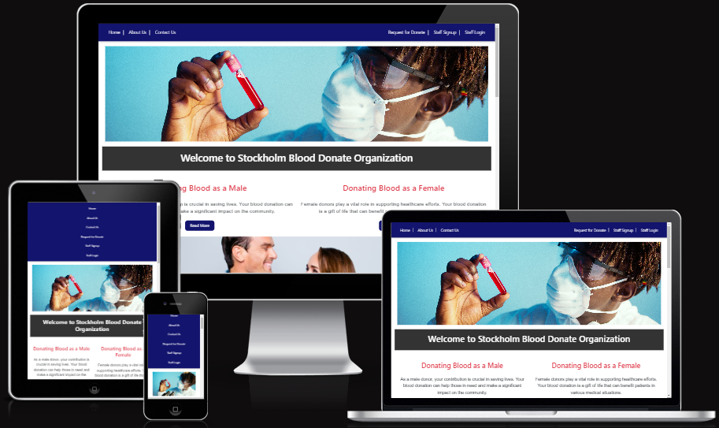

## Description

Welcome to the [Stockholm-Blood-Donation-Organization](https://stockholm-blood-donate-organization.onrender.com) Organization, your online platform for those who want to make a meaningful impact by donating blood. Our website provides a simple and convenient space for individuals to submit their information and join the community of compassionate donors. Join us in the mission to **save lives** — share the gift of life through your **blood donation**.

## Technology Used

The Stockholm Blood Donation Organization website is built using a modern stack of technologies to ensure a robust and interactive user experience. Here are the key technologies utilized in the development:

- **HTML:** The backbone for structuring the content and presenting information on the web.

- **CSS:** Responsible for styling and enhancing the visual presentation of the website, ensuring an appealing and consistent look.

- **JavaScript:** Employed for dynamic and interactive elements on the website, enhancing user engagement.

- **React.js:** A powerful JavaScript library used to build the user interface, enabling the creation of seamless, responsive, and efficient components.

These technologies work in harmony to deliver a user-friendly, visually appealing, and technologically advanced blood donation platform.

## Installation

Get started with the Blood Donate Organization website by following these simple steps:

1. **Clone the Repository:**

- git clone https://github.com/NaifZaghmout/Blood-Donate.git

2. **Navigate to the Project Directory:**
   
- cd Blood-Donate

3. **Install Dependencies:**

- npm install

**This command installs all the required dependencies, including:**

  - FontAwesome for SVG icons
  - Axios for making HTTP requests
  - Bootstrap for styling
  - Cloudinary for image and video management
  - History for managing session history
  - MDBReact for Material Design components
  - MSW for mocking API requests during development
  - React and related libraries for building the UI
  - SweetAlert for displaying attractive alerts
  - Web Vitals for measuring web performance

4. **Start the Development Server:**

- npm start

**Note:** Make sure you have Node.js and npm installed on your machine before proceeding with the installation steps.

5. **Admin Panel Access:**
To access the admin panel, you can use the following credentials:

- **Email:** admin@gmail.com
- **Password:** admin@123

6. **To Login To Staff Page**

Use : 

- **Email:** test@gmail.com
- **Username:**test
- **Password:**test@123

Or :

- **Signup To Create New Staff Account / Login After Create New Staff Account**

## Features

### 1. Navigation Bar and Hero Image

- **Navbar:**
  - Allows easy navigation with links to Home, About Us, Contact Us, Blood Donate Request, Staff Signup, Staff Login, and Staff Page.

      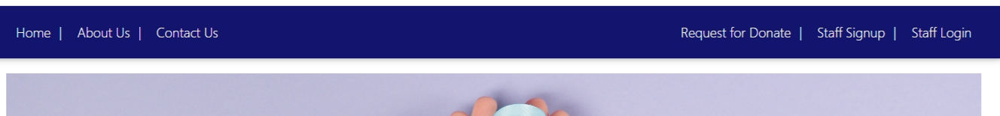

  
- **Hero Image:**
  - Displays a captivating hero image with automatic image rotation every 3 seconds.
  - Provides a brief description of the organization.

      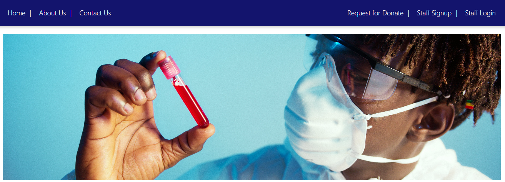

### 2. Header / Donating Blood as a Male and Female 

- **Header and Donating Blood as a Male and Female :**
  - Displays the name of the organization.
  - Includes information about blood donation for both males and females.
  - Read More Button: Redirects users to an external website for detailed information.

      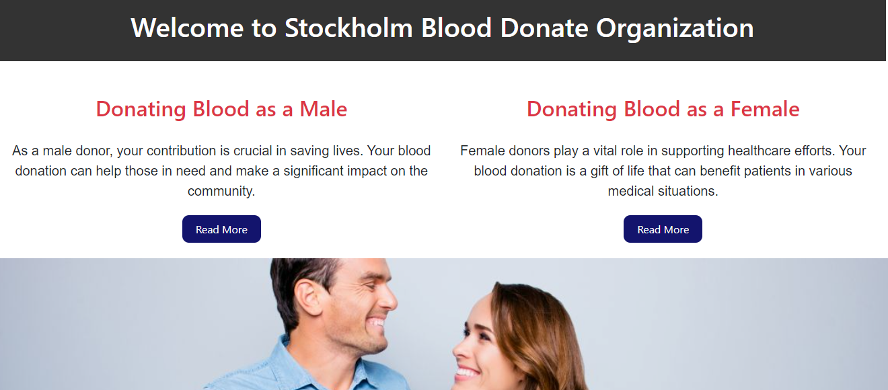

### 3. Health Benefits for Blood Donation Section

- **Benefits Section:**
  - Provides information about the health benefits of blood donation.
  - Read More Button: Redirects users to an external website for in-depth details.

      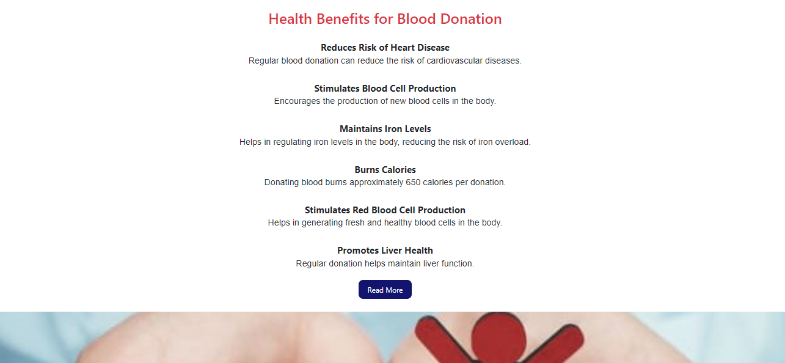

### 4. Who Can Donate? Section

- **Eligibility Section:**
  - Explains who can donate blood.
  - Read More Button: Redirects users to an external website for more information.

      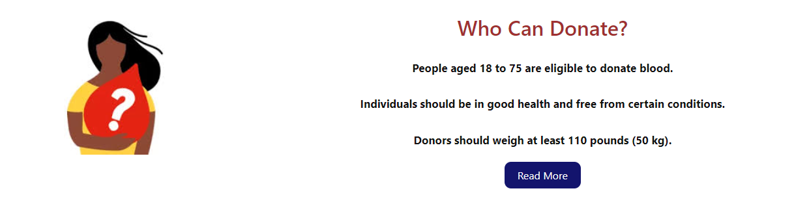

### 5. About Us Page

- **About Us:**
  - Features an informative page about the organization.

      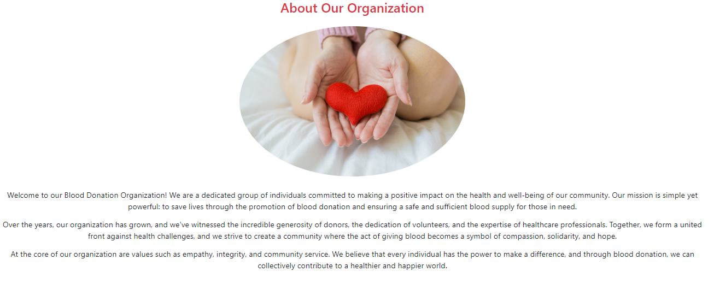

### 6. Why We Help Section in About Us

- **Reasons Behind Our Mission:**
  - Explores the reasons and motivations behind the organization's commitment to helping people donate blood.
  - Provides insights into the impact and significance of blood donation.

      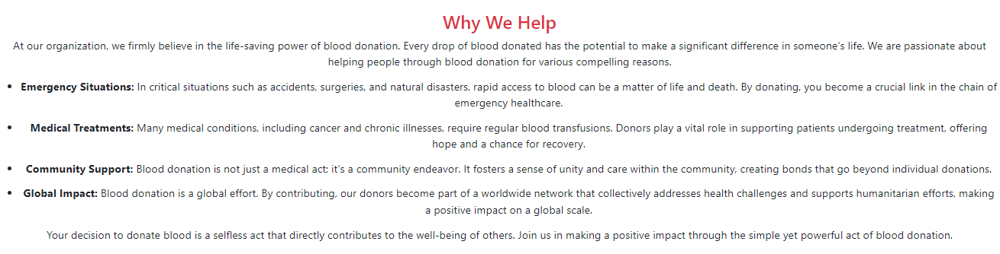

### 7. Contact Us Page

- **Contact Details:**
  - Provides organization contact information, including phone, address, and email.

      

  
- **Message Form:**
  - Includes a user-friendly form for users to send messages to the organization.
  - Fields for name, email, subject, and message.
  - Submit button to send the message.

      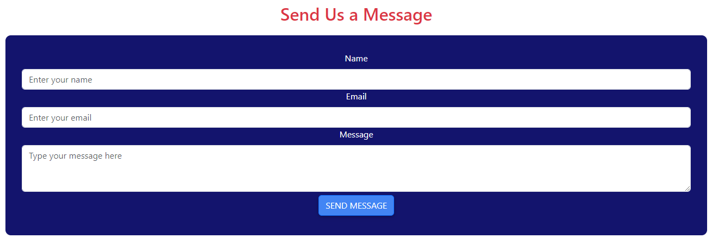

### 8. Request for Donate Page

- **Make a Difference Message:**
  - Features a compelling message: "Make a Difference with Your Donation."

       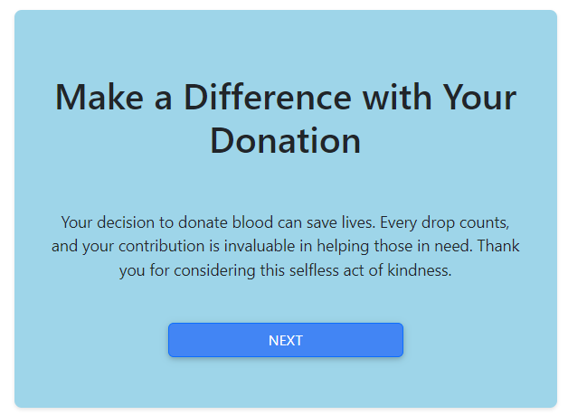

- **Ready to Be a Hero Message:**
  - Encourages users with the message: "Ready to Be a Hero?"

      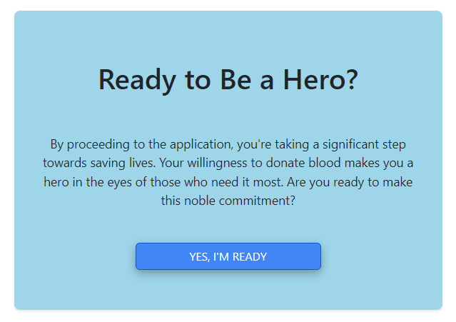

- **Blood Donation Application:**
  - Provides information about the Blood Donation Application.
  - Includes a link to the application for individuals who want to donate blood and make a difference.

      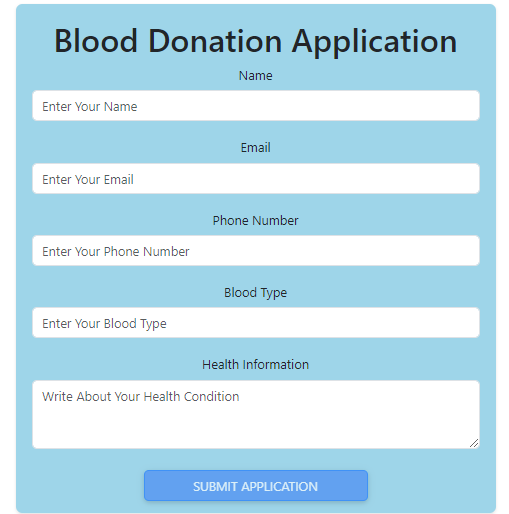

### 9. Staff Signup

- **Staff Signup Form:**
  - Allows staff members to register on the platform.

      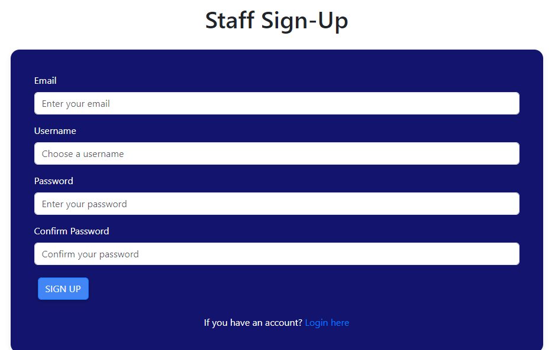

### 10. Staff Login

- **Staff Login Form:**
  - Enables staff members to log in to the management panel.

      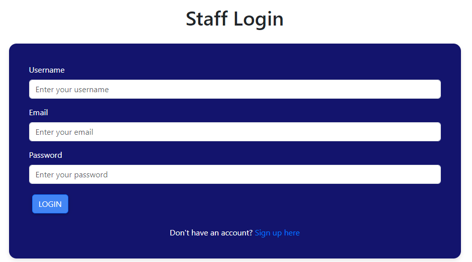

### 11. Staff Navigation Bar

- After successful login, staff members will have access to a dedicated navigation bar The staff navigation bar includes links to the following:

  - Home

  - About Us

  - Contact Us

  - Blood Donate Request

  - Staff Profile

      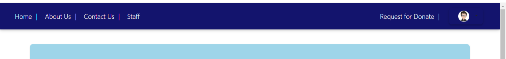

### 12. Accessing Staff Profile

  - A small avatar with an arrow is located on the right side of the navbar.
  - When staff members click on the avatar, a dropdown menu appears with two options: "Profile" and "Logout."
  - Clicking on "Profile" redirects staff members to their individual staff profile page.
  - Clicking on "Logout" logs the staff member out of the system

      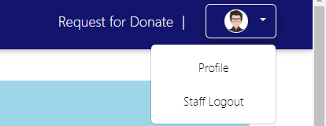

### 13.  Staff Profile Page

  - Staff members can access their profile page by clicking on the "Profile" option in the dropdown menu from the small avatar in the navbar.
  - The profile page displays the following information:
    - Staff ID
    - Email
    - Biography (BIO)
    - Current profile image

      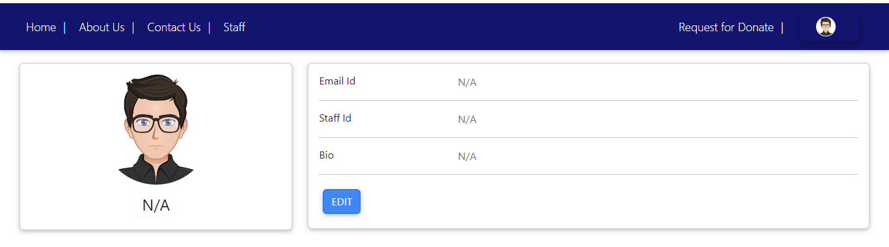

### Edit profile 

- Staff members can click on the "Edit" button to update their profile information, Like changing the profile image and editing the biography.

      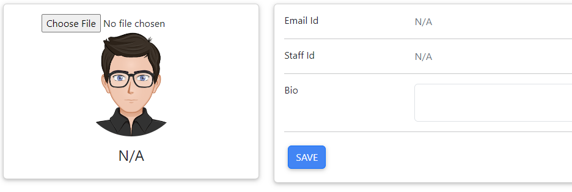

### 14. Staff Page

- **Staff Page:**
  - Contains a "Donors List" with information for people who want to donate blood.
  - Staff actions to review and manage the information submitted by people applying for blood donation.

      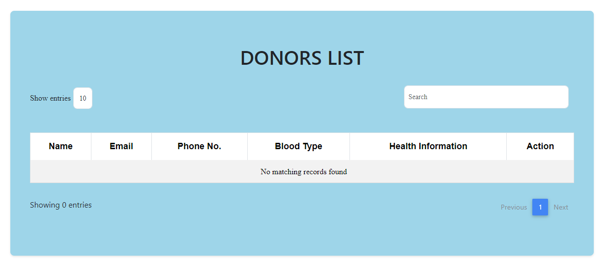

### 15. Footer

- **Footer:**
  - Contains social media links to follow the organization.
  - Includes a copyright statement.

      

### 16. Success messages

  - All Success messages

      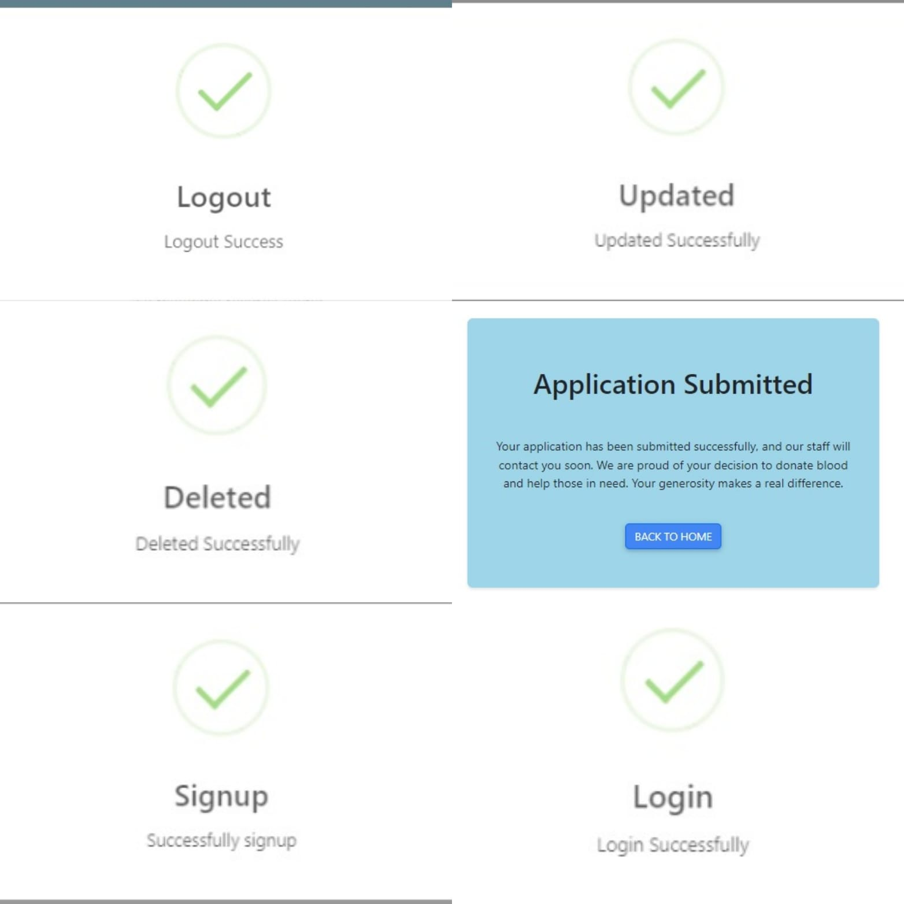

### 17. Error messages

  - All Error messages

  
      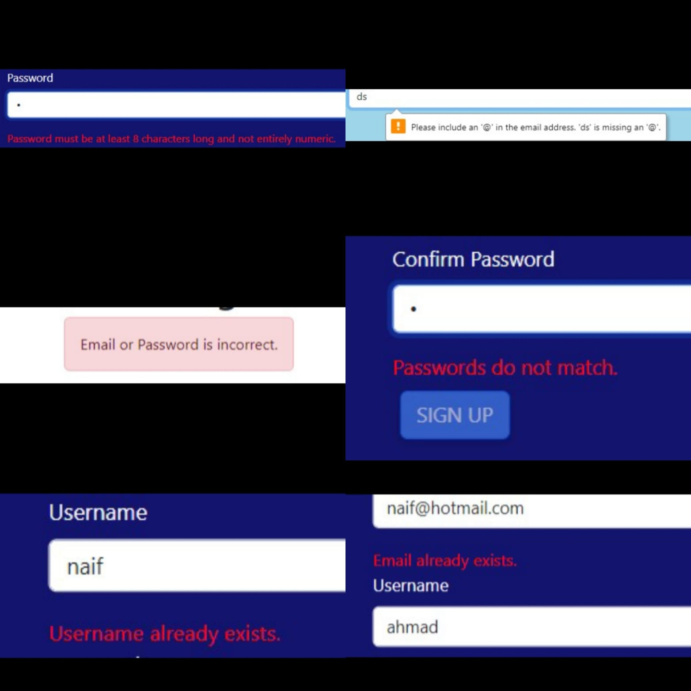

## Bugs and Remaining Bugs

#### Bugs 

1. Login Issue with Fetch

- **Error Handling with Fetch:**

**Issue:** The 'fetch' API used for login lacked robust error handling, resulting in unclear error messages for users with incorrect credentials.
**Symptoms:** Users encountered difficulties understanding login failures due to insufficient error feedback.
**Resolution:** Switching to axios improved error handling, providing clear and specific error messages for login failures.

  -  **Before:** Inadequate error handling with fetch

`fetch("api/login", {
  method: "POST",
  body: JSON.stringify(formData),
  headers: {
    "Content-Type": "application/json",
  },
})
.then(response => {
  // Inadequate error handling
})
.catch(error => {
  // Inadequate error handling
});`

  - **After:** Clear and specific error handling with axios

`try {
  const response = await axios.post("api/login", formData);
  // Clear and specific error handling
} catch (error) {
  // Clear and specific error handling
}`

2. Unable to Save Updated Donor Information

**Issue:** After making changes to donor information and clicking the "Save" button, the application does not save the updated information, and there is no success message.

**Symptoms:** Users attempting to save updated donor information encountered the following issues **(Inability to Trigger Save Actions)**

**Resolution:** After investigating the issue, it was discovered that the handleSubmit function was not correctly updating the donor information. The formData object was not being sent properly in the axios.put request.

  -  **Before:**

`const handleSubmit = async (event) => {
    event.preventDefault();

    try {
        await axios.put(`api/resolve/${Donorid}/`, formData);
        // ... (Old code)
    } catch (error) {
        // ... (Old handling)
    }
};`

  -  **After:**

  `const handleSubmit = async (event) => {
    event.preventDefault();

    try {
        await axios.put(`api/resolve/${Donorid}/`, formData);
        swal({
            title: "Updated",
            text: "Updated Successfully",
            icon: "success",
            buttons: false,
            timer: 2000,
        });
        setNameData("");
        setRender(true);
    } catch (error) {
        
    }
};`

 **Explanation:** The 'swal' (SweetAlert) success message and the state updates were not being triggered. By restructuring the code within the try block, we ensure that the success message is displayed, and the relevant state changes are applied after a successful API request.

This resolution should fix the issue, and now the donor information should be updated successfully.

#### Remaining Bugs

- None 

## Issue 

### Issue: Frequent Rebase in Gitpod

#### Problem
Encountering recurring rebase conflicts in Gitpod due to concurrent development efforts. The situation is exacerbated by the late adoption of Agile methodology after the project initiation, leading to increased frequency of code changes.

#### Impact
- Disrupts development workflow.
- Increases the risk of overlooking critical changes.
- Requires constant manual conflict resolution during rebase.

#### Resolution

1. **Communication:**
   - Establish clear communication channels for code changes coordination.
   - Encourage team members to communicate development plans to minimize overlap.

2. **Branching Strategy:**
   - Adopt a feature branching strategy to isolate and manage specific features.

3. **Pulling Strategy:**
   - Encourage regular pulling of changes from the main branch to local branches.
   - Use `git pull --rebase` for a cleaner integration.

#### Agile Methodology Integration (Late Adoption)

**Problem:**
- Agile methodology was introduced late in the project after the mentor section, causing a delay in its benefits.

**Resolution:**
- Strike a balance between Agile's iterative development and effective communication.
- Ensure team members are aligned with Agile practices to minimize disruptions.
- Consider conducting a retrospective to identify areas for improvement and streamline Agile integration.

## User Story
User stories required to implement each epic were created. These were categorised according to whether they were 'must have' features required to implement a Minimum Viable Product (MVP).
Please see the [Google sheet](https://docs.google.com/spreadsheets/d/1cyEBb2ZI2SYo6h-4pERsSZ_tiwFX7DpN6npcbnHGD4o/edit#gid=412412840) for detail.

## Project Themes and Epics

### Themes

The development of themes in this project was rooted in the overarching project goals. The identified themes include:

1. **Staff Management:**
   - Necessary to support the use of the system on an individual basis.
   - Aims to bring Staff users together into a 'tribe' to support Goal 1.

2. **Customer:**
   - Essential to enable key functionality required by Goal 1.

3. **Contact Customer:**
   - Chosen as a ‘nice to have’ feature, potentially implementable in version 2 with sufficient time.

4. **User Feedback and Information:**
   - Required to support Goal 1.

5. **Search:**
   - Required to support Goal 1.

### Epics

Themes were further refined into the following epics:

1. **Static Pages:**
   - Home Page
     - Navigation
     - Footer
   - About Us
   - Contact Us

2. **Request for Donate Page**

3. **Blood Donation Application:**
   - Name
   - Email Validation
   - Phone Number
   - Blood Group Type
   - Health Information
   - Submit Application
   - Back to Home

4. **Staff Sign Up:**
   - Email Validation
   - User Name
   - Password Creation
   - Confirm Password
   - Sign-Up Button
   - Login Button

5. **Staff Login:**
   - Enter Credentials
   - Login

6. **Donor List:**
   - Donor Information
   - Action
   - Search
   - Number of Donor List Display
   - Pagination
   - Navigation
   - Request A Donor
   - Staff Profile

7. **Accessing Staff Profile:**
   - View/Update Donor Profile
   - Logout

## Agile development methodology

- Agile development methodology GitHub issues and JIRA Project Management tool were used to document and track an agile development approach. A JIRA board was created to represent the product backlog. All user stories were initially added to the product backlog.
Development work was planned using a series of iterations each with a timebox of three working days, representing a total 11 story points (although the duration of each iteration in calendar days was variable due to fitting the three working days around work and other commitments).
A JIRA project board was created for each iteration, and user stories moved from the product backlog into the relevant iteration as each cycle of work began. User stories were labelled as 'must have', 'could have' or 'should have' goals for that specific iteration, and assigned story point values. Story points for 'must have' user stories never exceeded 6 (60%). 
A project kanban board was used to track progress, with user stories moved between 'Todo', 'In Progress' and 'Done' columns as appropriate. For example, the BD project board was captured at the start, in the middle and at the end:

- **To asses Jira use:**

  - **Full Name:** Naif Zaghmout
  - **Email:** Naif-zaghmout@hotmail.com
  - **Password:** poizon999
  - **Link to Jira:** `https://www.atlassian.com/software/jira`

  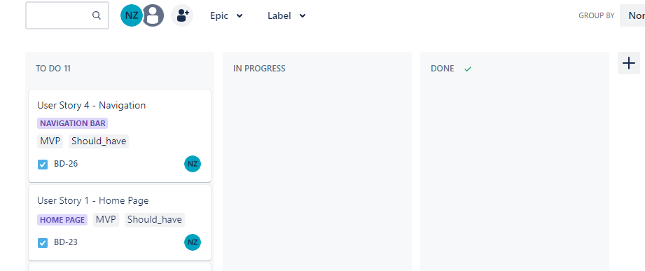
  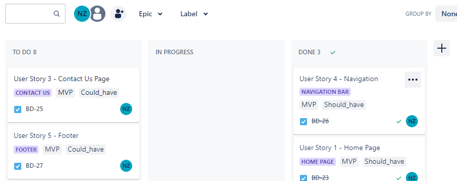
  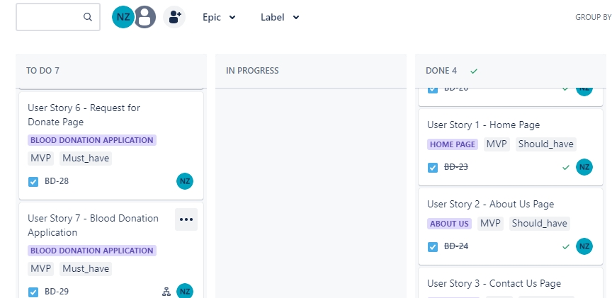
  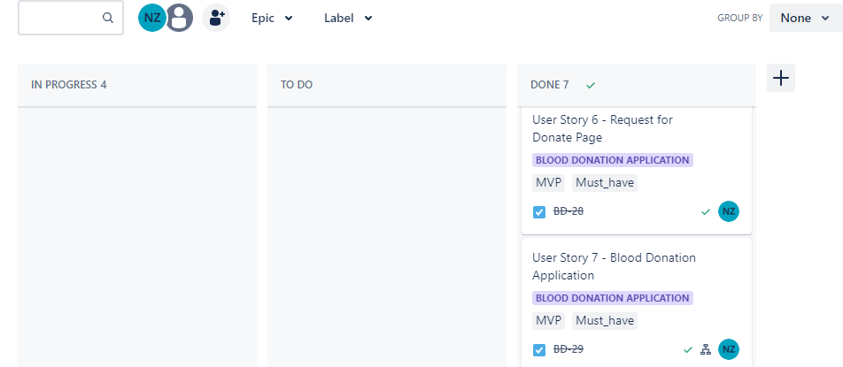
  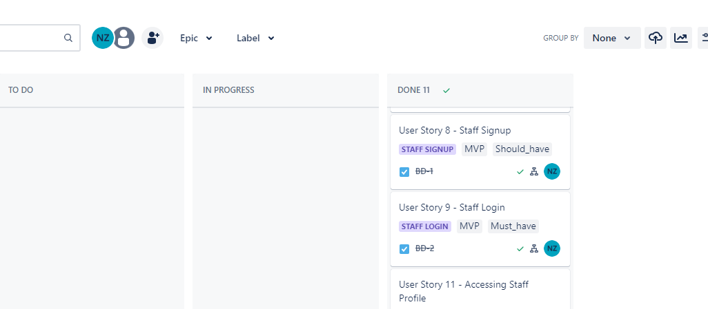
  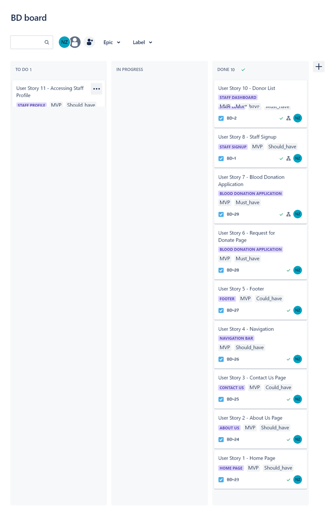
  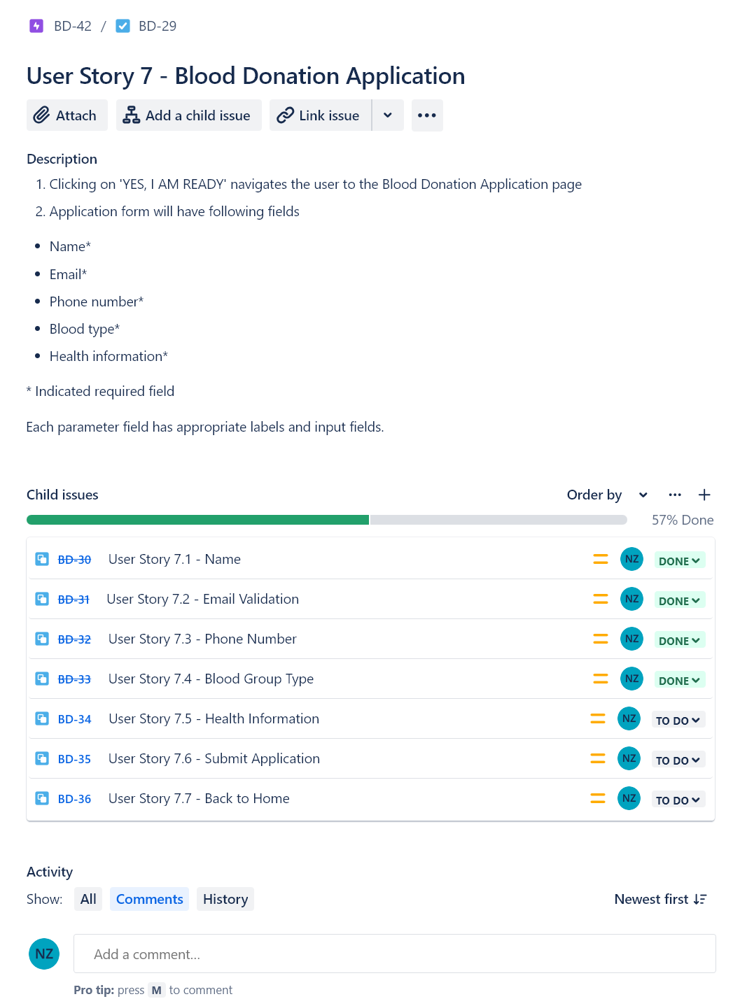

## Credits

- [getform.com](https://getform.com/): The "Send Us a Message" form code was adapted from [getform.com](https://blog.getform.io/how-to-create-an-html-form-that-sends-you-an-email/).

- [Elzero Web School ](https://www.youtube.com/channel/UCSNkfKl4cU-55Nm-ovsvOHQ): I watched a video on this YouTube channel to enhance my understanding of API calls. The content provided by Elzero Web School has been valuable in improving my skills and knowledge in this area.

- [tuthub.io](https://www.tuthub.io/resources/topics/Django%20REST%20framework): I have read content on this website to gain a deeper understanding of Django REST framework and its use cases. The information provided on tuthub.io has been valuable in expanding my knowledge and expertise in working with Django for RESTful APIs.

- [Django REST framework](https://www.django-rest-framework.org/community/tutorials-and-resources/): I have read content related to Django REST Framework to enhance my understanding and troubleshoot errors encountered while working with APIs. This resource has been instrumental in providing solutions and insights into effectively utilizing the Django REST Framework for building robust and efficient APIs.

## Deployment

Follow these steps to deploy your Django project on Render:

### Deployment Instructions

#### 1. Sign In to Render

Visit [Render](https://render.com) and sign in to your Render account.

#### 2. Create a New Web Service

In the Render dashboard, click the "+" button to create a new web service.

#### 3. Connect GitHub Repository

In the "Repository" section, select GitHub and connect your repository by providing the repository URL (`https://github.com/NaifZaghmout/Blood-Donate`).

#### 4. Configure Build Settings

Render will attempt to automatically detect build settings. Verify the build command is set to `npm install && npm run build` and the build directory is set to `build`.

#### 5. Create the Web Service

Choose a name, select the environment, and choose the region. Click "Create Web Service."

#### 6. Environment Variables (if needed)

If your app relies on environment variables, configure them in the Render dashboard under "Environment."

#### 7. Deployment

Monitor the deployment progress in the Render dashboard.

#### 8. Access Your Deployed App

Once deployment is successful, Render will provide a URL for your app.

#### 9. Update README (Optional)

If desired, add a Render deployment badge to your README for quick access.

#### 10. Monitor and Scale (Optional)

Use the Render dashboard to monitor performance and configure auto-scaling.

#### 11. SSL Configuration (Optional)

Configure SSL settings if you want to enable SSL for your custom domain.

#### 12. Custom Domain (Optional)

Configure your custom domain in the "Custom Domains" section of your service settings.

For more details and platform-specific information, refer to the [Render Documentation](https://render.com/docs).

## Testing

   Please refer to the **[TESTING.md](TESTING.md)** file for all test-related documentation.

## Blood-Donate Django Rest Framework API

This repository contains the Django Rest Framework API for the Blood-Donate application.

**Backend Repository:** [Blood-Donate Backend Repository](https://github.com/NaifZaghmout/Blood-Donate-Backend)
