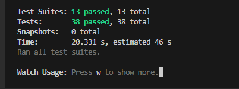
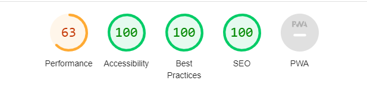

# Testing

## Manual Testing

### Navigation Bar

#### Navbar Hover

| # | User Actions                             | Expected Results            | Y/N | Comments                              |
|---|------------------------------------------|------------------------------|-----|---------------------------------------|
| 1 | Hover over each navbar item.              | Text turns red when mouse on it. | Y   | Ensure the visual cue (red color) on hover is visible for each navbar item.

#### Home

| # | User Actions                             | Expected Results                           | Y/N | Comments                              |
|---|------------------------------------------|---------------------------------------------|-----|---------------------------------------|
| 1 | Click on Home in the navbar.              | Redirected to the Home page.                | Y   | Ensure the content on the Home page is displayed.
| 2 | Hover over "Read More" in the male donate section. | Link turns red when mouse on it.    | Y   | Ensure the visual cue (red color) on hover is visible for the "Read More" link.
| 3 | Hover over "Read More" in the female donate section. | Link turns red when mouse on it.  | Y   | Ensure the visual cue (red color) on hover is visible for the "Read More" link.
| 4 | Hover over "Read More" in the health benefits section. | Link turns red when mouse on it. | Y   | Ensure the visual cue (red color) on hover is visible for the "Read More" link.
| 5 | Hover over "Read More" in the who can donate section. | Link turns red when mouse on it. | Y   | Ensure the visual cue (red color) on hover is visible for the "Read More" link.

### About Us

#### About Us Page Content

| # | User Actions                             | Expected Results                           | Y/N | Comments                              |
|---|------------------------------------------|---------------------------------------------|-----|---------------------------------------|
| 1 | Click on About Us in the navbar.         | Redirected to the About Us page.            | Y   | Verify the About Us page content.

### Contact Us

#### Contact Information

| # | User Actions                        | Expected Results                                     | Y/N | Comments                                       |
|---|-------------------------------------|-------------------------------------------------------|-----|------------------------------------------------|
| 1 | Hover over the blue box with contact information. | The box turns red when the mouse is on it, and blue when the mouse is not on it. | Y | Ensure the visual cue (color change) on hover is visible.
| 2 | View the contact information details (address, email, phone). | Correct contact information is displayed. | Y | Verify the accuracy of the displayed details.

#### Send Us a Massage Form

| # | User Actions                             | Expected Results                           | Y/N | Comments                                       |
|---|------------------------------------------|---------------------------------------------|-----|------------------------------------------------|
| 1 | Fill in the name, email, and massage fields in the form. | The form fields are filled with the relevant information. | Y | Ensure the form can be filled.
| 2 | Click on the "Send Massage" button.       | The massage is sent to the organization.    | Y | Verify the form submission process.
| 3 | Hover over the blue box with the form.    | The box turns red when the mouse is on it, and blue when the mouse is not on it. | Y | Ensure the visual cue (color change) on hover is visible.

### Request for Donate Page

#### Heroic Messages

| # | User Actions | Expected Results | Y/N | Comments |
|---|--------------|-------------------|-----|----------|
| 1 | View the "Make a Difference with Your Donation" message. | Message displays encouraging users to make a difference. | Y | Ensure the motivational message is visible.
| 2 | Click on "Next" button. | Redirected to the "Ready to Be a Hero?" message. | Y | Proceed to the next motivational message.
| 3 | View the "Ready to Be a Hero?" message. | Message encourages users to be heroes. | Y | Ensure the motivational message is visible.
| 4 | Click on "I'm Ready" button. | Redirected to the "Blood Donation Application." | Y | Proceed to the blood donation application.

#### Blood Donation Application

| # | User Actions | Expected Results | Y/N | Comments |
|---|--------------|-------------------|-----|----------|
| 1 | Fill out the required information (name, contact details, health-related questions, etc.). | Form fields are filled out accurately. | - | Fill out the application form with appropriate details.
| 2 | Click on "Submit" button. | Application is submitted successfully. | - | Verify successful submission of the blood donation application.

### Staff Signup

#### Staff Signup Form

| # | User Actions | Expected Results | Y/N | Comments |
|---|--------------|-------------------|-----|----------|
| 1 | Fill the username, email, password, and confirm password fields. | Form fields are filled out accurately. | - | Fill out the signup form with appropriate details.
| 2 | Click on "Signup" button. | Signup is successful, and a success message is displayed. | - | Verify successful signup process.
| 3 | Hover over the blue form.                 | The form gets bigger when the mouse is on it and returns to its original size when the mouse is not on it. | Y | Ensure the visual cue (size change) on hover is visible.

### Staff Login

#### Staff Login Form

| # | User Actions | Expected Results | Y/N | Comments |
|---|--------------|-------------------|-----|----------|
| 1 | Fill the username, email, and password fields with correct information. | Form fields are filled out accurately. | - | Fill out the login form with appropriate details.
| 2 | Click on "Login" button. | Login is successful, and a success message is displayed. | - | Verify successful login process.
| 3 | Hover over the login form. | The form becomes larger when the mouse is on it and returns to the original size when the mouse is not on it. | Y | Ensure the visual cue (size change) on hover is visible.

### Staff Navbar After Login

#### Navbar Content

| # | User Actions                             | Expected Results                           | Y/N | Comments                              |
|---|------------------------------------------|---------------------------------------------|-----|---------------------------------------|
| 1 | Successfully log in as a staff member.   | Redirected to the staff home page.          | Y   | Ensure staff members can log in successfully.
| 2 | Verify the presence of "Staff Page" on the left side of the navbar. | "Staff Page" is visible in the navbar. | Y | Confirm that the "Staff Page" link is present.
| 3 | Verify the presence of a small avatar on the right side of the navbar. | Avatar is visible on the right side. | Y | Confirm that the small avatar is present.
| 4 | Hover over the small avatar.              | The avatar expands, showing an arrow. | Y | Visual cue (size change) on hover should be visible.
| 5 | Click on the expanded avatar.             | A dropdown menu appears with options: "Profile" and "Logout." | Y | Dropdown menu should appear with the specified options.
| 6 | Hover over "Profile" option in the dropdown. | The option turns red when the mouse is on it. | Y | Visual cue (red color change) on hover should be visible.
| 7 | Click on "Profile" option.                | Redirected to the staff profile page.        | - | Ensure staff members can access their profile page.
| 8 | Hover over "Logout" option in the dropdown. | The option turns red when the mouse is on it. | Y | Visual cue (red color change) on hover should be visible.
| 9 | Click on "Logout" option.                 | A success message is displayed, and the staff member is redirected to the home page. | - | Verify the logout process and success message.

### Staff Page

#### Requests Information

| # | User Actions                             | Expected Results                           | Y/N | Comments                                       |
|---|------------------------------------------|---------------------------------------------|-----|------------------------------------------------|
| 1 | View the information for each person who requested blood donation. | Relevant information for each request is displayed. | Y | Ensure the displayed information is accurate.
| 2 | Click on the "Delete" button next to a request. | The request is deleted, and a success message is displayed. | - | Verify the deletion process and success message.
| 3 | Click on the "Edit" button next to a request. | Redirected to the person's application form. | Y | Proceed to edit the person's application.

#### Edit Application Form

| # | User Actions                             | Expected Results                           | Y/N | Comments                                       |
|---|------------------------------------------|---------------------------------------------|-----|------------------------------------------------|
| 1 | Click on "Edit" button in the person's application form. | Form fields become editable. | Y | Ensure the form is editable.
| 2 | Edit the relevant information in the form. | Form fields are updated with the edited information. | - | Verify the edit functionality.
| 3 | Click on "Save Changes" button.           | Changes are saved, and a success message is displayed. | - | Verify the save changes process and success message.
| 4 | Click on "Delete" button.                | The request is deleted, and a success message is displayed. | - | Verify the deletion process and success message.

#### Search and Entries

| # | User Actions                             | Expected Results                           | Y/N | Comments                                       |
|---|------------------------------------------|---------------------------------------------|-----|------------------------------------------------|
| 1 | Use the search bar to search for a specific patient by name. | Relevant patient information is displayed based on the search. | Y | Ensure the search functionality works as expected.
| 2 | Adjust the number of entries to display.  | The number of displayed entries is adjusted accordingly. | Y | Verify the control over the number of displayed entries.

### Staff Profile Page

#### Profile Information

| # | User Actions                             | Expected Results                           | Y/N | Comments                              |
|---|------------------------------------------|---------------------------------------------|-----|---------------------------------------|
| 1 | Successfully log in as a staff member.   | Redirected to the staff profile page.       | Y   | Ensure staff members can log in successfully.
| 2 | View personal information on the staff profile page. | Staff ID, Email, Biography, and current profile image are displayed. | Y | Verify the displayed information is accurate.
| 3 | Click on the "Edit" button.              | Redirected to the staff profile edit page.  | - | Ensure staff members can access the profile edit page.

#### Edit Profile Page

| # | User Actions                             | Expected Results                           | Y/N | Comments                              |
|---|------------------------------------------|---------------------------------------------|-----|---------------------------------------|
| 1 | Click on the "Edit" button on the staff profile page. | Redirected to the staff profile edit page. | - | Ensure staff members can access the profile edit page.
| 2 | View the existing BIO information.       | Current BIO information is displayed.      | Y | Confirm the displayed BIO information.
| 3 | Edit the BIO field in the staff page.    | The BIO field becomes editable.            | - | Verify the edit functionality for BIO.
| 4 | Upload a new profile image from the desktop. | Staff can choose and upload a new profile image. | - | Verify the image upload functionality.
| 5 | Click on "Save Changes" button.          | Changes are saved, and a success message is displayed. | - | Verify the save changes process and success message.

#### Logout

| # | User Actions                             | Expected Results                           | Y/N | Comments                                       |
|---|------------------------------------------|---------------------------------------------|-----|------------------------------------------------|
| 1 | Click on "Logout" in the navbar.         | Logout message is displayed, and the user is redirected to the home page. | - | Verify the logout process and success message.

### Automated Tests

Four automated tests were implemented to ensure the functionality and integrity of all pages and components.

### Test Results

- **Test Suites:** 13 passed, 13 total
- **Tests:** 38 passed, 38 total
- **Snapshots:** 0 total
- **Time:** 20.331 s, estimated 46 s

***Running the Tests***

- To run the automated tests, use the following command:

  - `npm test`

      

### ESLint JavaScript Validator

All JavaScript files in this project undergo validation using ESLint, a widely used JavaScript linter, to ensure code quality and adherence to best practices. The validation process has identified and corrected various issues, including:

- **Unnecessary Semi-colons:** Removed unnecessary semi-colons at the end of some statements for cleaner code.

- **Unescaped Apostrophes in HTML:** Escaped apostrophes in HTML text within some components to prevent unintended behavior.

- **Unused Variable:** Addressed an issue where an unused variable was present, optimizing the codebase.

- **Missing React Import Statements:** Ensured all necessary React import statements are included for proper component rendering.

#### ESLintwer Validation

In addition to ESLint, ESLintwer has also been utilized for further validation. It is worth noting that the ESLintwer validation process has successfully passed without raising any issues.

#### Running ESLint Locally:

To run ESLint locally and ensure code consistency, follow these steps:

1. Ensure Node.js and npm are installed on your machine.
2. Install ESLint globally: `npm install -g eslint`
3. Run ESLint: `eslint .`

The combination of ESLint and ESLintwer ensures a robust validation process, contributing to a maintainable and high-quality JavaScript codebase. Developers can contribute confidently, knowing that their code aligns with established coding standards.

### W3C CSS validator

- All CSS files were passed through the W3C validator

   

### W3C HTML validator

-  HTML file were passed through the W3C validator

      

 ### Lighthouse Testing

   
   
   
   
   
   
   

